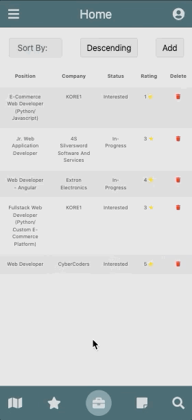

# jobify
A dynamic web application for job seekers who want to manage their job applications


## Technologies Used

- React.js
- React Router
- Webpack 4
- Bootstrap 4
- Node.js
- Express
- PostgreSQL
- HTML5
- CSS3
- AWS EC2


## Live Demo

Try the application live at [https://jobify.kurtyazdizadeh.com](https://jobify.kurtyazdizadeh.com)


## Features

- Users can search for a job and add it to their personal list.
- Users can manually add jobs to their personal list.
- Users can view saved jobs on a map.
- Users can rate, add notes, upload documents (resume, cover letter, letter of recommendation), and update the status of each saved job.
- Users can add notes for their resume, networking events, and general topics.
- Users can create and track goals they set for themselves (# of jobs saved, # of jobs applied to, etc.).

## Preview



## Development

### Getting Started

1. Clone the repository.

    ```shell
    git clone https://github.com/kurtyazdizadeh.jobify
    cd jobify
    ```

2. Install all dependencies with NPM.

    ```shell
    npm install
    ```

3. Import the database to PostgreSQL.

    ```shell
    npm db:import
    ```

4. Start the project. Once started you can view the application by opening http://localhost:3000 in your browser.

    ```shell
    npm run dev
    ```
